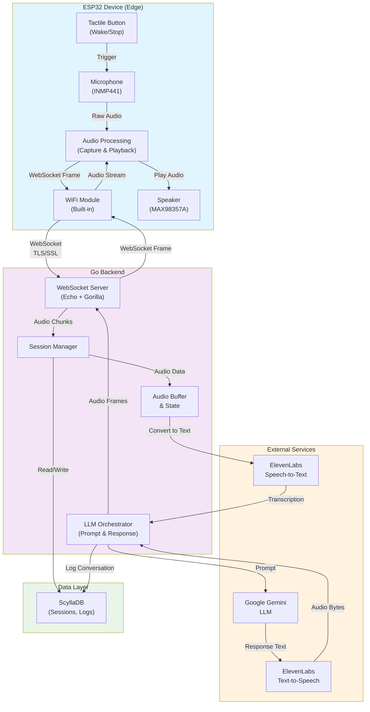
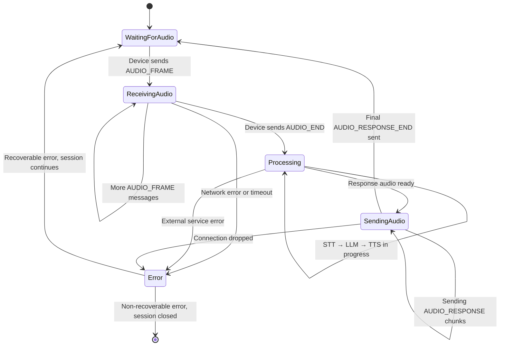
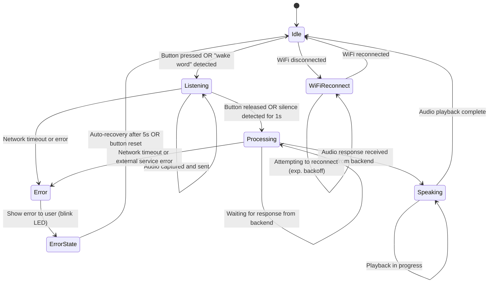
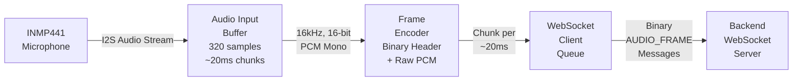
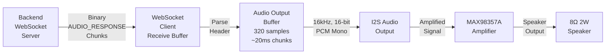
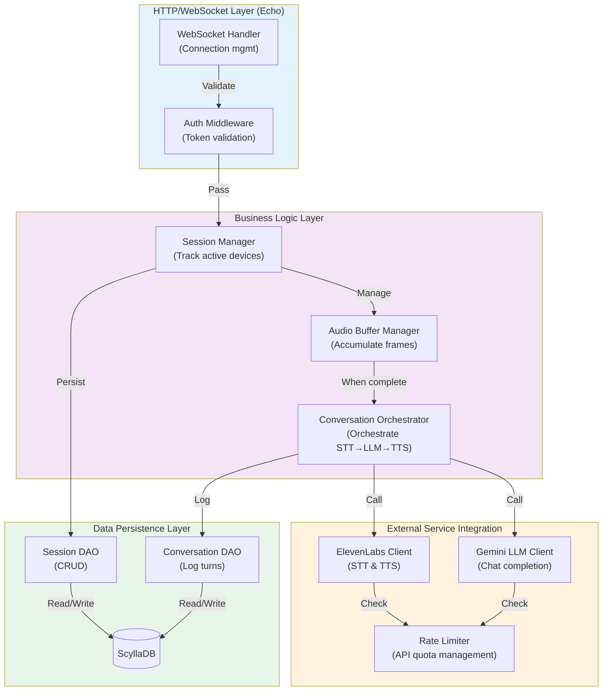

# Minimum Viable Implementation

## Table of Contents

1. [Overview & Tech Stack](#overview--tech-stack)
2. [System Architecture](#system-architecture)
3. [Communication Protocol](#communication-protocol)
4. [Device Implementation](#device-implementation)
5. [Backend Components](#backend-components)
6. [Data Models](#data-models)

---

## Overview & Tech Stack

### Development Philosophy
Focus on fast development, quick integration, and easy deployment. The MVP enables bi-directional voice interaction between a child and an AI-powered doll with <2 second response time and cloud connectivity.

### Tech Stack

**Backend:**
- Language: Go
- Web Framework: Echo
- WebSocket Library: Gorilla WebSocket
- Database: ScyllaDB (timeseries and session data)

**Device:**
- Microcontroller: Lolin32 Lite (ESP32-based devboard)
- Audio Input: INMP441 I2S MEMS microphone
- Audio Output: MAX98357A I2S class-D amplifier
- Speaker: 8Ω 2W
- User Interface: 1 tactile button
- Assembly: Breadboard prototype (development stage)

**External Services:**
- Speech-to-Text: ElevenLabs API
- Text-to-Speech: ElevenLabs API
- Conversational AI: Google Gemini LLM

**Infrastructure:**
- Communication: WebSocket over WiFi (TLS/SSL)
- Deployment: Cloud-based backend with 99% uptime target

---

## System Architecture

### High-Level Overview

The Arunika MVP system follows a cloud-connected architecture where the ESP32 device acts as an edge processor handling audio I/O and user interaction, while the Go backend orchestrates conversational logic and integrates external AI services.

### Architecture Diagram



### End-to-End Flow for Voice Interaction

1. **Capture Phase** (Device → Backend): User speaks to doll, ESP32 captures audio via INMP441 microphone and streams it to backend via WebSocket
2. **Processing Phase** (Backend → External): Backend buffers audio, sends to ElevenLabs for speech-to-text, then sends transcription to Gemini for conversational response
3. **Response Phase** (External → Device): Gemini response is sent to ElevenLabs for text-to-speech, audio is streamed back to device via WebSocket
4. **Playback Phase** (Device): Device receives audio frames and plays them through MAX98357A amplifier to speaker

### Latency Budget (Target: <2 seconds total)

- **Audio Capture & Transmission**: ~200ms (buffer to account for network)
- **Speech-to-Text (ElevenLabs)**: ~400ms
- **LLM Processing (Gemini)**: ~800ms
- **Text-to-Speech (ElevenLabs)**: ~400ms
- **Audio Playback**: ~200ms

**Design Strategy**: Audio is streamed in chunks during capture to minimize latency. The backend begins processing audio as it arrives rather than waiting for complete utterance. Chunked TTS response is sent to device incrementally.

### Scalability Considerations

- **Concurrent Connections**: WebSocket server designed to handle 10+ simultaneous device connections
- **Session Management**: Each device maintains a unique session ID for connection tracking and conversation context
- **Database Efficiency**: ScyllaDB is chosen for high-write throughput needed for logging audio interactions and conversation logs

---

## Communication Protocol

### WebSocket Connection Lifecycle

1. **Device Initiation**: Device connects to `wss://backend-domain/ws/device/{deviceId}`
2. **Authentication Handshake**: Device sends auth token, backend validates and creates session
3. **Active Connection**: Bidirectional message exchange for audio and control
4. **Keepalive**: Periodic ping/pong frames to detect stale connections
5. **Graceful Closure**: Device initiates close or backend closes after timeout (>5 min inactivity)
6. **Reconnection**: Device automatically reconnects with exponential backoff (1s, 2s, 4s, max 30s)

### Message Format

Control messages use JSON format (handshake, end markers, errors, keepalive). Audio data is sent as **binary frames** to minimize latency and reduce CPU overhead from base64 encoding/decoding.

#### Device Handshake (Device → Backend)

```json
{
  "type": "HANDSHAKE",
  "deviceId": "device-uuid-001",
  "firmwareVersion": "1.0.0",
  "timestamp": 1700000000
}
```

#### Backend Handshake Response (Backend → Device)

```json
{
  "type": "HANDSHAKE_ACK",
  "sessionId": "session-uuid-xyz",
  "status": "CONNECTED",
  "serverTime": 1700000001
}
```

#### Audio Frame (Device → Backend - Binary Format)

Audio frames are sent as raw binary data with the following structure:

```
Byte 0:           Frame Type (0x01 = AUDIO_FRAME)
Bytes 1-4:        Frame Number (uint32, big-endian)
Bytes 5-8:        Timestamp (uint32, milliseconds, big-endian)
Bytes 9-10:       Sample Rate (uint16, big-endian, e.g., 16000)
Bytes 11-12:      Total Frames in sequence (uint16, big-endian)
Bytes 13+:        Raw 16-bit PCM audio data (little-endian)
```

**Example**: A frame with frame #1, timestamp 1700000002, sample rate 16000Hz, containing 320 audio samples (20ms @ 16kHz):
```
[0x01] [0x00000001] [0x6540EE82] [0x3E80] [0x002D] [audio_data_640_bytes]
```

#### Audio End Marker (Device → Backend - JSON)

```json
{
  "type": "AUDIO_END",
  "sessionId": "session-uuid-xyz",
  "frameNumber": 45,
  "totalFrames": 45,
  "timestamp": 1700000045
}
```

#### Response Audio Frame (Backend → Device - Binary Format)

Response audio frames use the same binary structure as inbound audio:

```
Byte 0:           Frame Type (0x02 = AUDIO_RESPONSE)
Bytes 1-4:        Frame Number (uint32, big-endian)
Bytes 5-8:        Timestamp (uint32, milliseconds, big-endian)
Bytes 9-10:       Sample Rate (uint16, big-endian, e.g., 16000)
Bytes 11-12:      Flags (uint16, bit 0 = isLast)
Bytes 13+:        Raw 16-bit PCM audio data (little-endian)
```

#### Response Audio End (Backend → Device - JSON)

```json
{
  "type": "AUDIO_RESPONSE_END",
  "sessionId": "session-uuid-xyz",
  "frameNumber": 30,
  "totalFrames": 30,
  "timestamp": 1700000110
}
```

#### Error Message

```json
{
  "type": "ERROR",
  "code": "SERVICE_UNAVAILABLE",
  "message": "ElevenLabs API temporarily unreachable",
  "sessionId": "session-uuid-xyz",
  "recoverable": true
}
```

#### Keepalive (Both directions)

```json
{
  "type": "PING",
  "timestamp": 1700000200
}
```

Response:
```json
{
  "type": "PONG",
  "timestamp": 1700000201
}
```

### Conversation State Machine (Backend)



### Error Handling & Recovery

- **Timeout**: If device doesn't send frames for 30s during audio capture, backend sends `AUDIO_TIMEOUT` error
- **Service Unavailable**: If external API fails, backend sends `ERROR` with `recoverable: true` and device can retry
- **Network Disconnect**: Device detects loss of connection and attempts automatic reconnection
- **Partial Audio**: Backend handles incomplete audio frames gracefully and requests retransmission

---

## Device Implementation

### Hardware Architecture

#### Pin Configuration (Lolin32 Lite / ESP32)

| Component | Pin | Type | Purpose |
|-----------|-----|------|---------|
| INMP441 (Microphone) I2S CLK | GPIO 32 | Input | Audio bit clock |
| INMP441 I2S DIN (Data) | GPIO 33 | Input | Microphone audio data |
| INMP441 I2S WS (Word Select) | GPIO 27 | Input | Audio frame select |
| MAX98357A I2S BCLK | GPIO 25 | Output | Audio bit clock |
| MAX98357A I2S DOUT (Data) | GPIO 26 | Output | Speaker audio data |
| MAX98357A I2S LRCLK | GPIO 27 | Output | Audio frame select |
| MAX98357A GAIN | GPIO 22 | Output | Volume control |
| Tactile Button | GPIO 19 | Input (Pull-up) | Wake/stop trigger |
| LED (Status) | GPIO 21 | Output | Connection status indicator |

#### Audio Configuration

- **Sample Rate**: 16 kHz (chosen for ElevenLabs compatibility and network efficiency)
- **Bit Depth**: 16-bit PCM
- **Channels**: Mono
- **I2S Port 0**: Input (Microphone)
- **I2S Port 1**: Output (Speaker)

### Device State Machine



### Audio Processing Pipeline

#### Capture Pipeline (Microphone → WebSocket)



#### Playback Pipeline (WebSocket → Speaker)



### Device Configuration

- **WiFi SSID & Password**: Configured at factory during firmware flash (stored in NVS flash memory)
- **Backend Server Address**: Configured as firmware constant; updates via OTA
- **Device ID**: Unique UUID stored in device EFUSE during manufacturing
- **Auth Token**: Provisioned via secure backend during device registration

### Button Behavior

| State | Button Action | Result |
|-------|---------------|--------|
| **Idle** | Press & hold | Transition to Listening, start audio capture |
| **Listening** | Release | Transition to Processing, send AUDIO_END marker |
| **Listening** | Long press (>2s) | Cancel capture, send AUDIO_END, return to Idle |
| **Processing/Speaking** | Press | Send stop request, return to Idle |
| **Error** | Press | Reset device, attempt reconnection |

---

## Backend Components

### High-Level Architecture



### Component Descriptions

**WebSocket Handler**: Manages connection lifecycle, routes incoming messages to appropriate handlers, sends responses back to device.

**Session Manager**: Maintains active device sessions, tracks connection state, handles reconnection logic, maps deviceId → sessionId.

**Audio Buffer Manager**: Accumulates audio frames from device, detects end-of-speech marker, signals to Orchestrator when ready for processing.

**Conversation Orchestrator**: Orchestrates the sequence: receives audio → calls STT → receives transcription → calls LLM → receives response → calls TTS → streams audio back to device.

**External Service Clients**: Encapsulate API calls to ElevenLabs (speech services) and Gemini (LLM) with error handling and retry logic.

**Rate Limiter**: Tracks API quota usage for ElevenLabs and Gemini, prevents exceeding limits.

**DAO Layer**: Data Access Objects for persistence operations to ScyllaDB.

---

## Data Models

### Session Entity

```json
{
  "sessionId": "uuid-v4",
  "deviceId": "device-uuid-001",
  "startTime": 1700000000,
  "lastActivityTime": 1700000300,
  "status": "ACTIVE",
  "connectionState": "CONNECTED",
  "childProfile": {
    "age": 5,
    "name": "Tommy",
    "interests": ["dinosaurs", "space"]
  }
}
```

### Conversation Turn Entity

```json
{
  "turnId": "uuid-v4",
  "sessionId": "uuid-v4",
  "turnNumber": 1,
  "timestamp": 1700000045,
  "userInput": {
    "type": "AUDIO",
    "duration": 3.2,
    "transcript": "What is a T-Rex?",
    "audioHash": "sha256-hash"
  },
  "botResponse": {
    "transcript": "A T-Rex was a large dinosaur that lived millions of years ago...",
    "duration": 8.5,
    "audioHash": "sha256-hash"
  },
  "metrics": {
    "sttLatency": 450,
    "llmLatency": 820,
    "ttsLatency": 380,
    "totalLatency": 1650
  }
}
```

### Device Entity

```json
{
  "deviceId": "device-uuid-001",
  "firmwareVersion": "1.0.0",
  "hardwareModel": "Lolin32-Lite",
  "manufacturingDate": "2024-11-16",
  "registrationDate": 1700000000,
  "status": "ACTIVE",
  "lastSeenOnline": 1700000300,
  "owner": {
    "parentId": "parent-uuid",
    "dollName": "Rosie"
  }
}
```

### Configuration Entity (ScyllaDB)

```json
{
  "configKey": "elevenlabs.voice_id",
  "configValue": "child-friendly-voice-001",
  "updatedAt": 1700000000,
  "version": 1
}
```

---

## Key Design Decisions

1. **Chunked Streaming**: Audio is streamed in chunks rather than waiting for complete capture to minimize latency
2. **Binary Audio Frames**: Audio data sent as raw binary with minimal header (~13 bytes) to eliminate base64 encoding/decoding overhead. Control messages remain JSON for clarity.
3. **Single Button UI**: Simplifies device complexity; leverage audio context ("wake word", silence detection) for natural interaction
4. **ScyllaDB**: Selected for high write throughput needed for conversation logging and time-series data. Architecture supports vector search for future intelligent features.
5. **WebSocket TLS/SSL**: Ensures secure transmission of audio data and device credentials
6. **OTA Updates**: Firmware updates delivered via backend; device checks for updates on connection
7. **Graceful Degradation**: If external APIs fail, device receives error response and can retry or offer offline fallback responses

---

## Future Extensions

### ScyllaDB Vector Search for Intelligent Responses

As the system matures, ScyllaDB's vector search capabilities will enable more intelligent, personalized conversational experiences without requiring additional databases or architectural changes.

#### 1. **Semantic Search for Conversation Context**

**Use Case**: When processing a child's query, search historical conversations for semantically similar questions to understand context and provide better responses.

- Embed user transcripts using a lightweight embedding model (e.g., MiniLM, all-MiniLM-L6-v2)
- Store embeddings alongside conversation turns in ScyllaDB vector columns
- At query time, embed the new user input and perform semantic similarity search
- Use top-K similar conversations to augment the prompt to Gemini LLM
- **Benefit**: Reduces redundant responses, maintains conversational consistency, improves response quality

**Schema Addition**:
```json
{
  "turnId": "uuid-v4",
  "sessionId": "uuid-v4",
  "userInput": {
    "transcript": "What is a dinosaur?",
    "embedding": [0.12, -0.45, 0.78, ...]  // Vector stored in ScyllaDB
  }
}
```

#### 2. **Personalized Context Memory**

**Use Case**: Build a persistent memory of each child's interests, learning level, and conversation patterns to personalize responses over time.

- Extract semantic features from each conversation (topics, complexity level, sentiment)
- Store child profile embeddings representing aggregate interests and learning preferences
- Query similar profiles to find effective response patterns
- Use collaborative filtering principles to recommend engagement strategies
- **Benefit**: More engaging interactions, better-suited responses, improved user satisfaction

**Schema Addition**:
```json
{
  "childProfile": {
    "childId": "uuid",
    "interestEmbedding": [...],     // Aggregate of conversation topics
    "knowledgeLevel": 3.2,          // Inferred from past interactions
    "learningStyle": "visual",      // Derived from engagement patterns
    "topicsOfInterest": ["dinosaurs", "space", "animals"],
    "embeddingsUpdatedAt": 1700000000
  }
}
```

#### 3. **Response Quality Optimization**

**Use Case**: Identify which response patterns lead to higher engagement and child satisfaction, enabling continuous improvement of conversational strategies.

- Store embedding vectors of successful responses alongside engagement metrics (duration, repeat interactions, sentiment)
- Perform similarity search to identify response patterns that resonate with similar users
- Feed these patterns back to the LLM prompt as "successful response examples"
- **Benefit**: Data-driven improvement of conversation quality, reduced need for manual prompt tuning

#### 4. **Scalability for 100+ Devices**

Vector search enables intelligent scaling:
- Instead of querying LLM for every interaction, semantically similar interactions can share cached responses
- Reduces API costs and latency for frequent topics
- Enables clustering of similar interactions for batch learning

### Implementation Timeline

- **MVP (Current)**: ScyllaDB for conversation logging, no embeddings
- **Phase 2 (3-6 months)**: Add embedding generation and semantic search for conversation context
- **Phase 3 (6-12 months)**: Personalized context memory and response optimization
- **Phase 4 (12+ months)**: Advanced features like predictive engagement and automated prompt optimization

### Technical Considerations

- **Embedding Generation**: Can be done server-side or async (not blocking the response path) using batch processes
- **Embedding Model**: Start with a lightweight model (~30MB) to minimize compute overhead; on-device embedding possible if needed
- **Vector Index**: ScyllaDB's vector search handles indexing automatically; no separate vector database needed
- **Cost**: Vector embeddings add minimal storage (~300 bytes per embedding) and are queried efficiently
